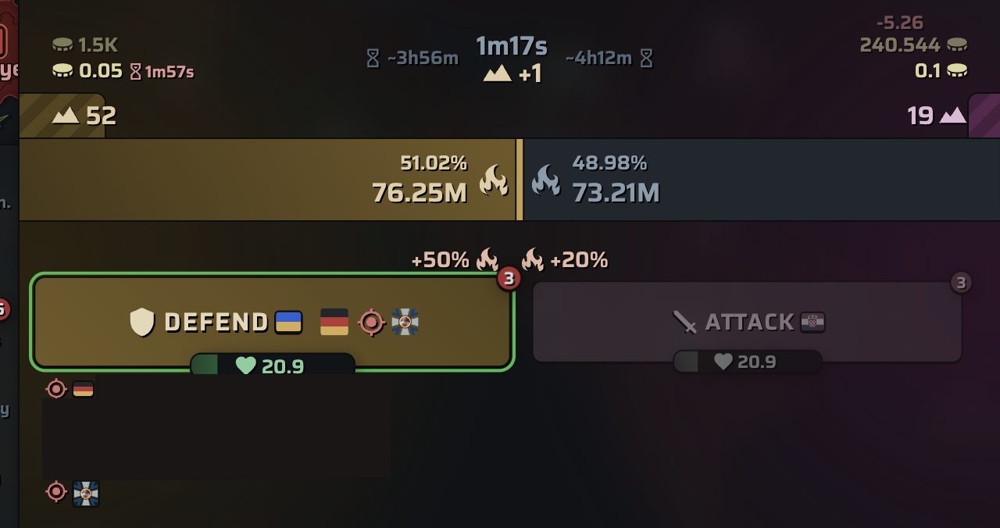

# Battle Advisor

> 🌐 **🇬🇧 English** · [🇩🇪 Deutsch](Battle-Advisor.de)

*Experimental.* On battle pages, PROST highlights the button for **your side**
so you don't attack/defend the wrong way, and previews the active orders inline.

## What you see

- **Your side's button is highlighted** (green outline, slightly enlarged); the
  other side is muted (dimmed, grayscale). In the screenshot the **DEFEND** side
  is highlighted and **ATTACK** is muted.
- **Compact orders** are cloned into the button: the country flags / military
  unit icons that have posted orders for that side, shown inline so you can read
  the call to action at a glance.

## How your side is chosen

1. **Primary — your allied list.** The side whose country flag code is in your
   configured allied codes (e.g. `de,pt`) is highlighted. Set this in
   [Settings](Settings) → *Allied country codes*.
2. **Fallback — order-giving side.** If neither side matches your allied list,
   the side that has **orders** (from a country *or* a military unit) is treated
   as a temporary ally for this battle and highlighted.
3. **No guess.** If both sides or neither side have orders and nothing matches
   your allied list, nothing is highlighted — PROST won't guess.

## Enabling

Off by default (experimental). Turn it on in [Settings](Settings) → *Battle
advisor*, then enter your **allied country codes** (comma-separated, lowercase,
e.g. `de,pt`). The allied-codes field appears once the feature is enabled.

> Decision support only. PROST highlights a button — you still click it.
