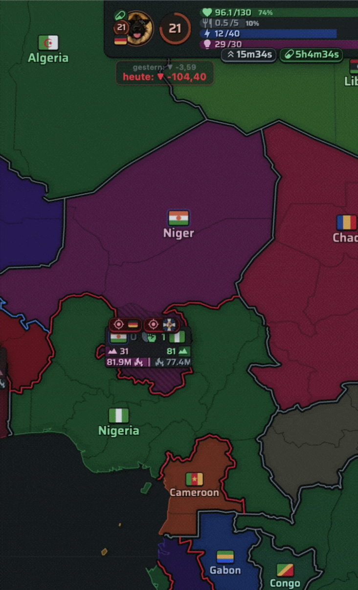

# Täglicher P&L Tracker

Der **Tägliche Gewinn- & Verlust-Tracker (P&L)** hilft dir, deine finanzielle Bilanz in WareEra in Echtzeit zu überwachen. Er berechnet die Netto-Gewinne oder -Verluste des aktuellen Tages basierend auf deinen Marktaktivitäten, Crafting-Ergebnissen und dem Verschleiß deiner Ausrüstung.

## Hauptfunktionen

- **Transaktions-Journal**: Erfasst Goldbewegungen beim Kauf und Verkauf von Ressourcen und Ausrüstung auf dem Markt.
- **Ausrüstungs-Verschleiß**: Erkennt sinkende Haltbarkeit (Durability) deiner aktiven Gegenstände (Waffen/Rüstung) und verbucht den geschätzten Goldverlust (Verschleißkosten) automatisch, um dich vor unerwarteten Reparaturkosten zu warnen.
- **Crafting-Bilanz**: Protokolliert die Materialkosten von Rezepten gegen den geschätzten Marktwert der hergestellten Gegenstände.
- **Echtzeit-HUD**: Blendet eine kompakte Gewinn- und Verlustübersicht direkt auf dem Spielbildschirm ein.

## Funktionsweise (Klick- und Delta-Tracking)

Der P&L-Tracker nutzt eine lokale Zustands-Engine zur Erfassung finanzieller Ereignisse:
1. **Gold-Deltas**: Jedes Mal, wenn sich dein Inventar aktualisiert oder eine Transaktion abgeschlossen wird, berechnet der Tracker die Differenz und ordnet sie dem Ledger zu.
2. **Verschleiß-Updates**: Haltbarkeitsänderungen werden beim Scannen erfasst. Sinkt die Haltbarkeit, wird dies als Verschleißverlust gebucht. Steigt sie (durch Reparaturen oder Neukäufe), wird die Basislinie neu gesetzt, ohne falsche Verschleißkosten zu erfassen.
3. **Automatischer Reset**: Das Journal setzt sich täglich um Mitternacht lokaler Zeit automatisch zurück. Die Bilanz des Vortages wird archiviert und ein neues, leeres Tracker-Blatt gestartet.

## Konfiguration

Der P&L-Tracker ist **standardmäßig aktiviert**.

Wenn du ihn deaktivieren möchtest, öffne den PROST-Einstellungsdialog (Zahnrad-Symbol ⚙) und schalte die Option **P&L Tracker** im Bereich Features aus.
