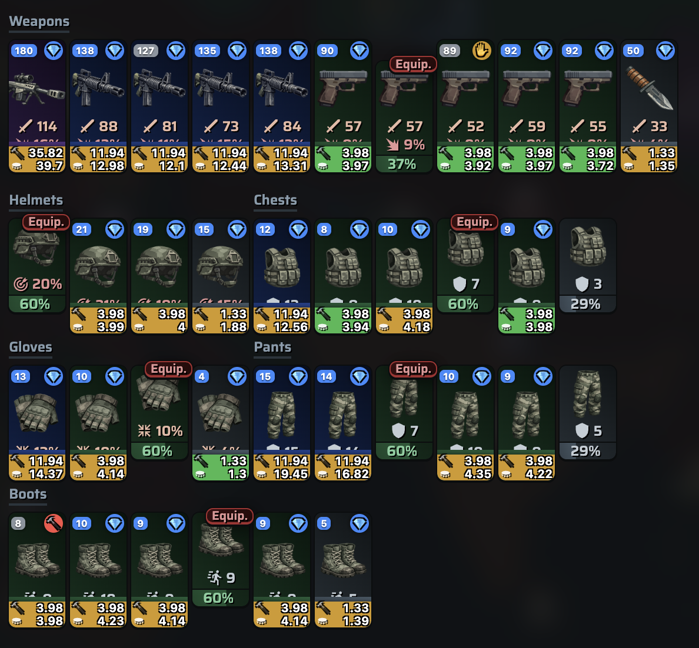

> 🌐 [🇬🇧 English](Inventory-Advisor) · **🇩🇪 Deutsch**

# 🎒 Inventory Advisor

Legt auf jede Inventarkarte ein Overlay mit einer Empfehlung — **KEEP**, **HOLD**,
**SELL** oder **SCRAP** — und zeigt dazu Stat-Wert sowie Schrott- und Marktpreis.
Rein lesend, keine Automatisierung.

## Empfehlungen (Farbe + Symbol)

| Symbol | Empfehlung | Bedeutung |
| --- | --- | --- |
| 💎 | **KEEP** (Blau) | Behalten. Greift bei deinen Top-3-Beständen (je Typ/Tier) oder wenn das Item im obersten Drittel (Top Roll, Top 33 %) der Live-Angebote bzw. deines Inventars liegt. |
| ✋ | **HOLD** (Orange) | Zurückhalten/reservieren. Item liegt in den besten 10 % der theoretisch möglichen Stat-Spanne (Top Itemscore). Wird nur vergeben, wenn nicht ohnehin 💎 KEEP. |
| 💰 | **SELL** (Grün) | Auf dem Markt verkaufen. Wirtschaftlich, weil der Netto-Marktpreis (abzüglich 1 % Steuer) über dem Schrottwert liegt. |
| 🔨 | **SCRAP** (Rot) | Zerlegen/verschrotten. Wirtschaftlich, weil der Schrottwert über dem Netto-Marktpreis liegt. |

## Overlays auf den Karten

- **Oben links (Stat-Wert):** Rüstungs-Stat bzw. Waffen-Score. *Blauer Hintergrund*
  = Top 3 im Bestand (Stock Keep). *Grau* = normal.
- **Unten (Preise):** Gestapelt 🔨 [Schrottwert] und 💰 [Marktpreis]. *Grüner
  Hintergrund* = Verschrotten ist besser. *Oranger Hintergrund* = Verkaufen ist besser.

Preisformat: `[Schrottwert] / [Marktpreis]`.

## Hinweise

- **Ausgerüstete Items** (Badge „Equip.") werden von der Empfehlung ausgenommen.
- **Beschädigte Items** (Haltbarkeit unter 100 %) erhalten keine Verkaufs-/Schrott-
  Tooltips, da ihr Marktwert nicht verlässlich bestimmbar ist.
- Frische Marktwerte (Equipment und Schrott) benötigen einen
  [API-Token](Settings.de#api-token). Ohne Token nutzt der Advisor zwischengespeicherte
  bzw. gescrapte Marktpreise.

Siehe auch: [Scrap-Flip-Indikator](Scrap-Flip-Indicator.de) ·
[Einstellungen](Settings.de)
