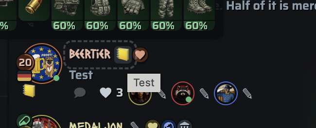
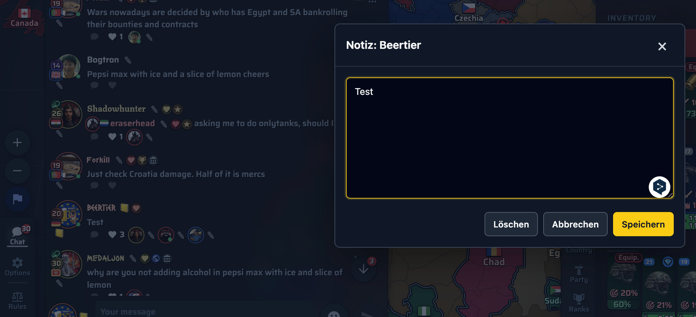

# Player Notes

> 🌐 **🇬🇧 English** · [🇩🇪 Deutsch](Player-Notes.de)

*Experimental.* Adds a small note icon next to player links across WareEra so
you can jot a private reminder about anyone — diplomacy, debts, "do not trust",
whatever. Notes are stored **locally** in your browser.

## The note icon

A 📒 icon appears next to player names (in chat, profiles, lists). Gray = no
note yet; highlighted = a note exists.

## Editing a note

Click the icon to open the note editor. Type your note and **Save**
(*Speichern*), **Cancel** (*Abbrechen*), or **Delete** (*Löschen*) it.

## Storage & privacy

- Notes live only on **your machine** (`GM_setValue`). They are not synced,
  shared, or sent anywhere.
- Clearing your userscript manager's storage removes them.

## Enabling

Off by default (experimental). Turn it on in [Settings](Settings) → *User notes
on player links*.

> **Conflict note:** if you also run the standalone **WareEra User Notes**
> script, disable this toggle to avoid two note icons.
